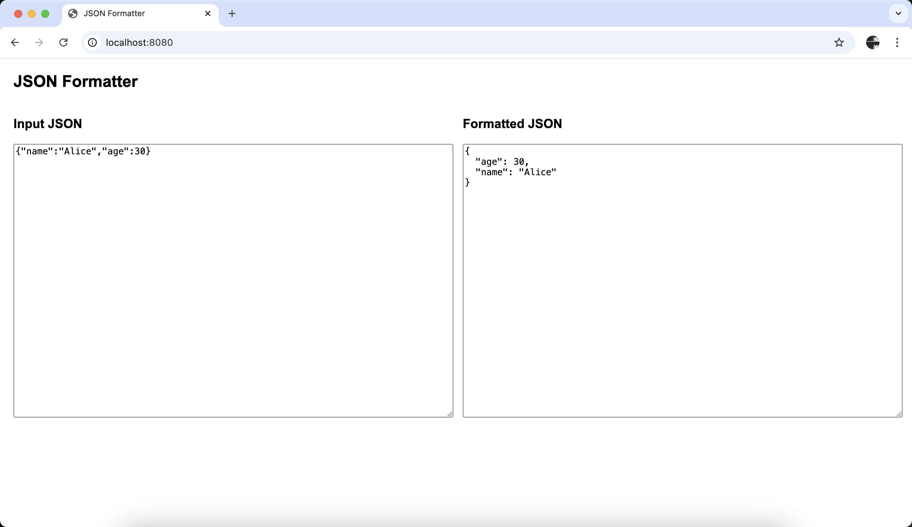

A simple JSON formatter using Go and WebAssembly

### Usage:

#### Docker 

1. build image

```shell
docker build -t json-formatter .
```

2. docker run

```shell
 docker run --name json-formatter -d -p 8080:80 json-formatter
 ```

Open your browser and visit http://localhost:8080

#### Develop

Just open the index.html

### Screenshot



